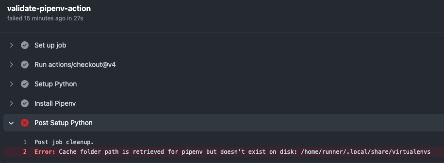

# Install Pipenv - GitHub Action

This is a simple GitHub Action for installing Pipenv.

Unfortunately installing Pipenv is a pain in the butt when you want to use caching. See [this GitHub issue](https://github.com/actions/setup-python/issues/436) for an example. Here's a screenshot of the annoying issue I ran into:



The official recommendation of the Python GitHub Action is to use something like the below (see [here](https://github.com/actions/setup-python/blob/main/docs/advanced-usage.md#caching-packages)):

```yaml
steps:
- uses: actions/checkout@v4
- uses: actions/setup-python@v5
  with:
    python-version: '3.9'
    cache: 'pipenv'
- name: Install pipenv
  run: curl https://raw.githubusercontent.com/pypa/pipenv/master/get-pipenv.py | python
- run: pipenv install
```

This GitHub Action basically does the same thing as the "Install pipenv" step. It's easier for me to remember than a URL - and easier to roll out as a replacement for https://github.com/dschep/install-pipenv-action.

## Usage

```yaml
steps:
- uses: actions/checkout@v4
- uses: actions/setup-python@v5
  with:
    python-version: '3.9'
    cache: 'pipenv'
- uses: kmcquade/install-pipenv-action@v1
```

## License

The scripts and documentation in this project are released under the [MIT License](LICENSE).
